# Docker: Basic to Advanced

A comprehensive learning guide for Docker, covering concepts from foundational basics to advanced architectures and orchestration.

## 📋 Table of Contents
- [Overview](#overview)
- [Learning Path](#learning-path)
- [Resources](#resources)
- [Prerequisites](#prerequisites)
- [Getting Started](#getting-started)

## Overview

This repository contains a structured learning path for mastering Docker, from containerization fundamentals to production-ready orchestration with Docker Compose. Whether you're new to containerization or looking to deepen your Docker expertise, this guide provides visual resources and comprehensive documentation.

## Learning Path

### 🔵 Beginner - Docker Fundamentals
- Understanding containerization and why Docker matters
- Docker architecture and components
- Working with Docker images
- Running and managing containers
- Docker networking basics

### 🟡 Intermediate - Docker Advanced Concepts
- Docker volumes and data persistence
- Docker Compose for multi-container applications
- Container networking and communication
- Docker image layers and optimization
- Building efficient Dockerfiles

### 🔴 Advanced - Production Readiness
- Docker Compose internal architecture
- Multi-container application orchestration
- Network internals and advanced networking
- Performance optimization
- Deployment strategies

## Resources

This repository includes architectural diagrams and visual guides:

### Core Architecture
| Resource | Description |
|----------|-------------|
|  | **Docker Architecture Overview** - Understanding the core components and how Docker works |
|  | **Docker Pipeline Flow** - The complete workflow from image building to container execution |

### Container Management
| Resource | Description |
|----------|-------------|
|  | **Docker Image Layers** - Understanding how Docker images are built in layers for efficiency |

### Networking
| Resource | Description |
|----------|-------------|
|  | **Docker Network Types** - Different networking modes and their use cases |
|  | **Docker Compose Network Internals** - How services communicate in multi-container environments |

### Volumes & Storage
| Resource | Description |
|----------|-------------|
|  | **Docker Volume Types** - Different storage options for persistent data |

### Docker Compose
| Resource | Description |
|----------|-------------|
|  | **Docker Compose Internal Architecture** - How Docker Compose orchestrates multiple containers |
|  | **Problems Docker Compose Solves** - The challenges Docker Compose addresses in multi-container deployments |

## Prerequisites

- Basic understanding of containerization concepts (optional but helpful)
- Familiarity with command-line/terminal
- Docker installed on your system ([Installation Guide](https://docs.docker.com/get-docker/))
- Docker Compose installed ([Installation Guide](https://docs.docker.com/compose/install/))

## Getting Started

1. **Clone this repository:**
   ```bash
   git clone https://github.com/Ashukr321/Complete-Docker-Basic-to-Advanced.git
   cd Complete-Docker-Basic-to-Advanced
   ```

2. **Review the resources:**
   - Start with `docker_architecture_overview.svg` to understand the basics
   - Progress through other resources based on your learning level

3. **Practice:** Follow along with Docker tutorials and practice with the concepts presented in each diagram

## 📚 Recommended Learning Order

1. Docker Architecture Overview
2. Docker Pipeline Flow
3. Docker Image Layers
4. Docker Network Types
5. Docker Volume Types
6. Docker Compose Internal Architecture
7. Docker Compose Network Internals
8. Compose Problem Solved

## 🤝 Contributing

Feel free to contribute improvements, additional resources, or documentation to enhance this learning guide.

## 📄 License

See [LICENSE](LICENSE) file for details. 
